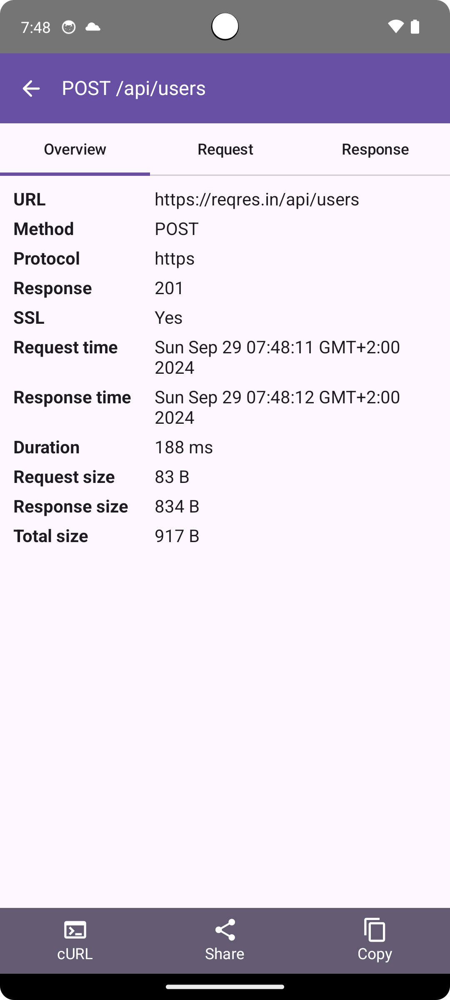
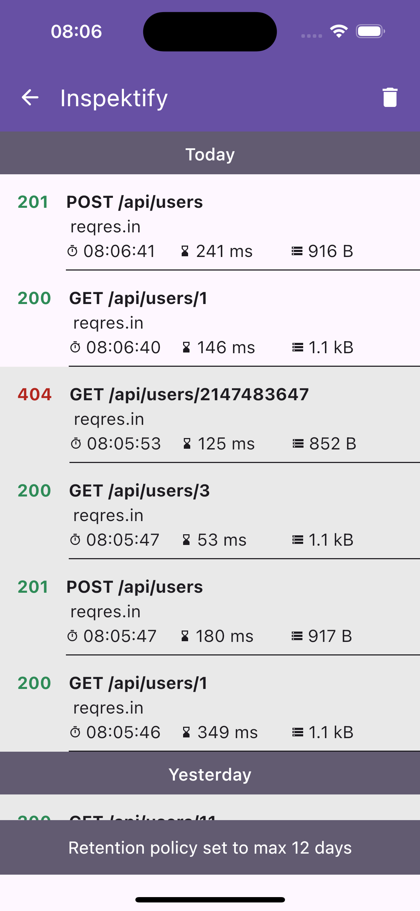

<h1 align="center">Inspektify</h1>

Inspektify is Kotlin Multiplatform Library for mobile platforms iOS and Android.
It allows you observing network of your application in realtime directly on your mobile device.

<p align="center">


</p>

# Screenshots

### Android

<table align="center">
  <tr>
    <td>List</td>
    <td>Details</td>
  </tr>
  <tr>
    <td></td>
    <td></td>
  </tr>
</table>

### iOS

<table align="center">
  <tr>
    <td>List</td>
    <td>Details</td>
  </tr>
  <tr>
    <td></td>
    <td></td>
  </tr>
</table>

# Getting started

This library can be used only on projects that are using Ktor for network communication. If there is
a need to support a different library besides Ktor open an issue for it.

### 1. Gradle

This library is available on mavenCentral. To use it in your project add following repository if you
don't have it yet.

```
repositories { 
    ...
    mavenCentral()
}
```

Add the library dependency to your project like this:

```
commonMain.dependencies {
    ...
    debugImplementation("io.github.bvantur:inspektify:1.0.0-alpha01") // TODO
}
```

### 2. Kotlin

You need to configure the library wherever you are creating a Ktor client in your project.
Configuration follows the defined design of the Ktor library by installing a plugin directly to the
Ktor client.
Minimum code for including Inspektify library to the project is:

```
HttpClient() {
    ...
    install(InspektifyKtor)
}
```

# Features

This library was built with flexibility in mind. We don't want to force the behavior of the library
upon the developer who uses this library, so we implemented a couple of configurations for the
library to make it more flexible.

### 1. Presentation type

By default the library detects shake gesture of the device and show the list of network transactions
that happened within the app. But we want to enable developers to override this behavior if that
suits them better.
That is why we introduced `presentationType` configuration to our Inspektify configuration.

You can choose between

**PresentationType.AutoShake** // selected by default

or

**PresentationType.Custom**

You can change that behavior when installing our plugin to Ktor client like this:

```
install(InspektifyKtor) {
    presentationType = PresentationType.Custom
}
```

If you choose `PresentationType.Custom` you also need to provide a way to show Inspektify debug tool
in some other way. For that purpose there is a way to start Inspektify tool debug window with the
next code:

```
InspektifyKtor.startInspektify()
```

### 2. Log level

By default, logging of network communication in-app output is not enabled. But if you want you can
enable it in the same way as we do it for the presentation type.
The settings property that we can change for the logging is `logLevel`

You can choose between

**LogLevel.None** // selected by default

or

**LogLevel.Info**

or

**LogLevel.Headers**

or

**LogLevel.Body**

or

**LogLevel.All**

You can change it when installing our plugin to Ktor client like this:

```
install(InspektifyKtor) {
    logLevel = LogLevel.All
}
```

Here you can see what each LogLevel does when configured for your client:

- **LogLevel.None** -> doesn't log anything
- **LogLevel.Info** -> logs only base information of network transaction like url, method and
  response
  code.
- **LogLevel.Headers** -> prints everything that **LogLevel.Info** prints plus all the headers of
  request and response.
- **LogLevel.Body** -> prints everything that **LogLevel.Info** prints plus all the payload sent
  with
  request and response.
- **LogLevel.All** -> prints everything for a network transaction.

# Exclude library

Since this is a debug tool and we wouldn't want for our users to have possibility to access this
tool we need to exclude the library from the release build. This can be easy done with if statement
before
installing plugin for a Ktor client like this:

```
HttpClient() {
    ...
    if (isDebug()) {
      install(InspektifyKtor)
    }
}
```

## Contact me

<a href="https://github.com/BVantur">
    
</a>
<a href="https://www.linkedin.com/in/bla%C5%BE-vantur-9aa466a0/">
    
</a>
<a href="https://medium.com/@bvantur">
    
</a>

# Licence

```
MIT License

Copyright (c) 2024 Blaž Vantur

Permission is hereby granted, free of charge, to any person obtaining a copy
of this software and associated documentation files (the "Software"), to deal
in the Software without restriction, including without limitation the rights
to use, copy, modify, merge, publish, distribute, sublicense, and/or sell
copies of the Software, and to permit persons to whom the Software is
furnished to do so, subject to the following conditions:

The above copyright notice and this permission notice shall be included in all
copies or substantial portions of the Software.

THE SOFTWARE IS PROVIDED "AS IS", WITHOUT WARRANTY OF ANY KIND, EXPRESS OR
IMPLIED, INCLUDING BUT NOT LIMITED TO THE WARRANTIES OF MERCHANTABILITY,
FITNESS FOR A PARTICULAR PURPOSE AND NONINFRINGEMENT. IN NO EVENT SHALL THE
AUTHORS OR COPYRIGHT HOLDERS BE LIABLE FOR ANY CLAIM, DAMAGES OR OTHER
LIABILITY, WHETHER IN AN ACTION OF CONTRACT, TORT OR OTHERWISE, ARISING FROM,
OUT OF OR IN CONNECTION WITH THE SOFTWARE OR THE USE OR OTHER DEALINGS IN THE
SOFTWARE.
```